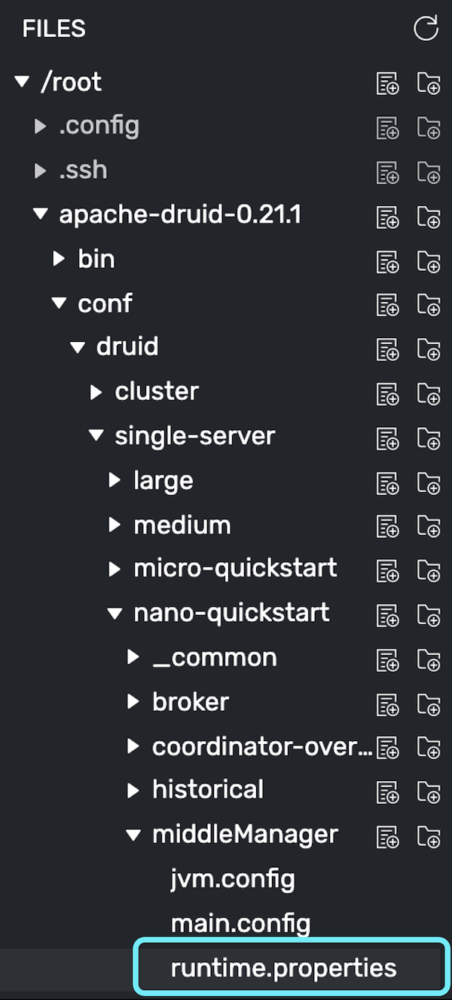

Let's look at JavaScript aggregators.
You may not need them often, but when you do, it's nice to be familiar with them.


In this exercise we will create an aggregated field that is the sum of all CPU and memory values within the rollup.
Admittedly, this is a bit contrived, but this example allows us to demonstrate JavaScript aggregation.


<h2 style="color:cyan">Step 2</h2><hr style="color:cyan;background-color:cyan;height:5px">

We'll use the raw data we created in the previous exercise.
If you want to review the data, you can use this command.

```
head -10 /root/raw_data.csv \
   | column -t -s,
```

<h2 style="color:cyan">Step 3</h2><hr style="color:cyan;background-color:cyan;height:5px">

Let's build on the ingestion spec from the previous exercise.

Switch to the editor tab.


<h2 style="color:cyan">Step 4</h2><hr style="color:cyan;background-color:cyan;height:5px">

Open the ingestion spec file.


<h2 style="color:cyan">Step 5</h2><hr style="color:cyan;background-color:cyan;height:5px">

We want to create a metric column named <i>cpu_memory</i> that contains the sum of all _cpu_ entries and all _memory_ entries in the rollup.
If you want to figure this out for yourself, you may want to review the [docs](https://druid.apache.org/docs/latest/querying/aggregations.html#javascript-aggregator).


<p><span style="color:cyan"><strong><em>NOTE: </em></strong></span><i>The cpu and memory fields you will reference are the raw data fields.
In the previous exercise we created simple aggregations for these fields. The JavaScript aggregators operate on the original values and not the aggregated values.
</i></p>


<details>
  <summary style="color:cyan"><b>Need some help?</b></summary>
<hr style="color:cyan">
Add the following code to the <i>metricsSpec</i> and don't forget the comma to separates entries.
<pre><code>{
  "type": "javascript",
  "name": "cpu_memory",
  "fieldNames": ["cpu", "memory"],
  "fnAggregate" : "function(current, a, b)      { return current + parseFloat(a) + parseFloat(b); }",
  "fnCombine"   : "function(partialA, partialB) { return partialA + partialB; }",
  "fnReset"     : "function()                   { return 0; }"
}</code></pre>
<hr style="color:cyan">
</details>

<h2 style="color:cyan">Step 6</h2><hr style="color:cyan;background-color:cyan;height:5px">

Save the file by clicking the _save_ icon.


<h2 style="color:cyan">Step 7</h2><hr style="color:cyan;background-color:cyan;height:5px">

We need to enable JavaScript for the _middleManger_.
Open the properties file for the _middleManager_.

<p><span style="color:cyan"><strong><em>NOTE: </em></strong></span><i>We are running a single-server nano configuration.
Be sure to open the correct runtime.properties file for the middleManger.
We only enable JavaScript for the middleManager to limit any security exposure.
</i></p>




<h2 style="color:cyan">Step 8</h2><hr style="color:cyan;background-color:cyan;height:5px">

At the end of the properties file, add the following to enable JavaScript.

```
druid.javascript.enabled=true
```

<h2 style="color:cyan">Step 9</h2><hr style="color:cyan;background-color:cyan;height:5px">

Save the file by clicking the _save_ icon.


<h2 style="color:cyan">Step 10</h2><hr style="color:cyan;background-color:cyan;height:5px">

Switch back to the Shell tab.


<h2 style="color:cyan">Step 11</h2><hr style="color:cyan;background-color:cyan;height:5px">

Let's restart the _middleManger_ so it can use the updated configuration.
Since the _middleManger_ is running as a Linux service, if we kill the process, Linux will restart it for us.

Here's a command that finds the _middleManger_ process ID and passes it to the _kill_ command.

```
kill $(ps -ef | grep middleManager | grep -v grep | awk 'NF{print $2}')
```

<h2 style="color:cyan">Step 12</h2><hr style="color:cyan;background-color:cyan;height:5px">

Ingest the data using the following command.

```
/root/apache-druid-0.21.1/bin/post-index-task \
  --file /root/ingestion-spec.json \
  --url http://localhost:8081
```

<h2 style="color:cyan">Step 13</h2><hr style="color:cyan;background-color:cyan;height:5px">

Query and review the data to see what it looks like.

<p><span style="color:cyan"><strong><em>NOTE: </em></strong></span><i>It may take a minute after the ingestion completes for the data to load.
If you don't see the cpu_memory field in the results, wait a minute and try it again.
</i></p>


```
curl -s -X 'POST' \
  -H 'Content-Type:application/json' \
  -d @/root/query.json http://localhost:8888/druid/v2/sql \
  | jq
```

Verify that the <i>cpu_memory</i> field values are the sum of the _cpu_ and _memory_ columns.

<h2 style="color:cyan">Very cool! You have unleashed the power of JavaScript aggregations during ingestion!</h2>
